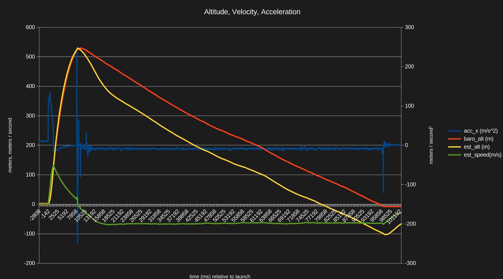

# model-rocketry
This is a repository for model rocketry projects. Currently, there are two:

1. The _Nene_ "Flight Computer" that measures, computes, and logs a variety of properties like altitude and acceleration.
2. A collection of 3D models for "sleds" so you can securely mount sensors, computers, batteries, etc. in a variety of payloads.

## The Nene Flight Computer

If you've ever launched a model rocket, you've probably also wondered how high it went, how fast it traveled, and what sort of g-forces it experienced. There are some commercially-available altimeters and accelerometers, but I wanted to make my own. 

This is very much still a work-in-progress, and I do not recommend you use this code for... anything. I'll update this readme with instructions, part lists, and all the information necessary to build, use, and modify things when the code stabilizes enough that every change isn't breaking.

That said, if you want glance at the code, it's all open-source and there are already a number of neat features:

1. (Almost entirely) written in micropython
2. Different configurations for different rocket sizes -- from tiny 25mm x 75mm (BT-50) to larger 45mm x 128mm (BT-65) to 4" High-Power rockets.
3. Measurement of all sorts of data: acceleration, altitude, rotation, and magnetic heading using easily-available parts from various "maker" stores like [Adafruit](https://www.adafruit.com/) and [Sparkfun](https://www.sparkfun.com/).
4. Cross-checking of the various measurements against each other and previous data using [Kalman Filtering](https://en.wikipedia.org/wiki/Kalman_filter). This also lets us extract fairly reasonable values for properties we can't measure directly, like airspeed. 
5. The measurements are also integrated into a full [Attitude and Heading Reference System](https://en.wikipedia.org/wiki/Attitude_and_heading_reference_system).
6. Help finding your rocket with GPS and long-range radio.

### Outputs

The computer must be powered up and loaded in your rocket before you launch it. After it lands, it will broadcast its location (and maximum altitude). Once you retrieve your rocket, the computer will have a (compressed) .csv file with lots of information about the flight:

* Acceleration in X, Y, and Z axes
* Rotation in X, Y, and Z axes
* Magnetic field strength in X, Y, and Z axes
* Altitude, derived from barometric pressure and GPS
    * Note: GPS altitude readings are pretty buggy. I wouldn't use them for much.
* Ambient temperature
* Latitude and longitude
* Estimated yaw, pitch, roll, altitude, and speed 
    * These estimates assume the rocket is pointed up and hasn't had its ejection charge fire yet -- they're not valid once the rocket separates.

The first line of the file has some extra metadata:

* The user-provided name of the computer
    * This is helpful if you have several and want to know which generated a particular file
* Time and date of launch
* Battery level and initialization and touchdown
* Computer temperature at initialization and touchdown

If you're curious, you can see an example [.csv file here](example-output.csv). This was my Level 1 certification flight, recorded on a LOC-IV using an Aerotech H148R.

With this data, you can calculate whatever sort of thing you might be interested in. For example, here's a nice summary I generate using a spreadsheet:

| Condor                              | Saturday, June 13, 2026 | 11:52:03 AM |       |
|-------------------------------------|-------------------------|-------------|-------|
|                                     | SI                      | Imperial    |       |
| Maximum:                            |                         |             |       |
| … Altitude (m, ft)                  | 528.93                  | 1,735.34    |       |
| … Velocity (m/s, mph)               | 131.66                  | 294.52      |       |
| … Acceleration (m/s2, g)            | 132.83                  | 13.54       |       |
|                                     |                         |             |       |
| Velocity:                           |                         |             |       |
| … Off Rod (1m) (m/s, mph)           | 15.77                   | 35.28       |       |
| … at Ejection Charge (m/s, mph)     | 17.05                   | 38.13       |       |
| … Descent (Average) (m/s, mph)      | 6.01                    | 13.44       |       |
|                                     |                         |             |       |
| Altitude at Ejection Charge (m, ft) | 523.99                  | 1,719.12    |       |
| Launch – Burnout duration (Stages)  | 00:01.51                |             |       |
| Launch – Ejection Charge duration   | 00:07.88                |             |       |
| Descent duration                    | 01:28.38                |             |       |
|                                     |                         |             |       |
| Frame Time (Avg, StdDev)            | 22.22                   | 0.42        |       |
| Frame Time (95th %, 99th %, Worst)  | 23.00                   | 23.00       | 23.00 |
| Battery Level (Start, End)          | 93.86                   | 87.35       |       |
| MCU Temp (Start, End) (°C)          | 28                      | 38          |       |

You can also graph any or all of the information over time:

### Why the name "Nene"?

The name comes from one of my favorite books, ["Blackouts" by Justin Torres](https://us.macmillan.com/books/9781250338068/blackouts/). [Wikipedia](https://en.wikipedia.org/wiki/Nene_(name)) explains that:
> In Spanish, [Nene] is generally a masculine term of endearment and an affectionate nickname meaning "baby".

I believe it also a [type of goose](https://en.wikipedia.org/wiki/Nene_(bird)).

## The Payload-Bay Sleds

The "sleds" are [OpenSCAD](https://openscad.org/) files that you can tweak as necessary and then print with a 3D printer. If you use an "Aero" filament, they should be pretty light, but still relatively sturdy. They provide a grid-type arrangement (patterned after [this product](https://www.adafruit.com/product/5774)) that lets you easily and securely mount breakout boards (or anything with mounting holes) using M2.5 nylon screws.